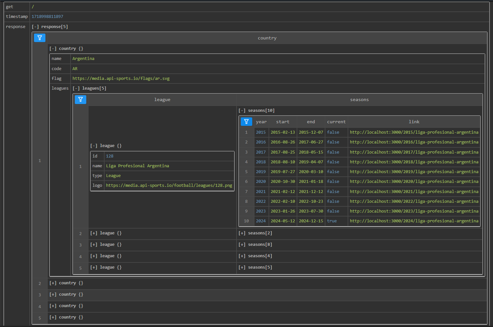
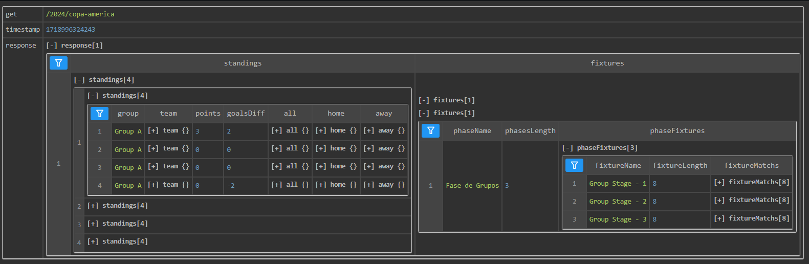

# Documentacion API Footballito

- [Arquitectura de la API](#arquitectura)
- [Resumen sobre GET](#get-resumen)
- [Resumen sobre POST](#post-resumen)

---

## GET Resumen:

| Endpoint | Descripción |
| -------- | ---------------------------------------------------------------------------------------------------------------------------------------------------------------------------------------------------------------------------------------------------------------------------------------------------------------------------------------------------------------------------------------------------------------------------------------------------------------------------------------------------------------------------------------- |
| `/`      | Devuelve un arreglo de objetos que contienen el nombre del Pais, un codigo de dos o tres caracteres, el icono y una lista de ligas. Esta lista de ligas contiene un objeto con los datos de la liga (como el nombre, un ID, el tipo de liga y su icono), y una lista de temporadas que contienen el año, la fecha de inicio y fin en string, una propiedad booleana y un link para realizar el fetch desde el Front cada una. **Este enpoint es importante para realizar la navegacion en el front, sin el no hay nada que visualizar.** |

### Ejemplo endpoint `/`

```json
{
	"response": [
		{
			"country": {
				"name": "Argentina",
				"code": "AR",
				"flag": "https://media.api-sports.io/flags/ar.svg",
				"leagues": [
					{
						"league": {
							"id": 128,
							"name": "Liga Profesional Argentina",
							"type": "League",
							"logo": "https://media.api-sports.io/football/leagues/128.png"
						},
						"seasons": [
							{
								"year": 2015,
								"start": "2015-02-13",
								"end": "2015-12-07",
								"current": false,
								"link": "http://localhost:3000/2015/liga-profesional-argentina"
							},
							{...},
							{...},
							{...},
							{...},
							{...},
							{...},
							{...},
							{...},
							{...},
						]
					}
				]
			}
		},
		{...},
		{...},
		{...},
		{...}
	]
}

```



| Endpoint | Descripción|
|---|---|
| `/:season/:league`<br>**ej**:`/2024/liga-profesional-argentina` | Devuelve un arreglo que contiene **un objeto** con dos propiedades: `standings` y `fixtures`. Los `standings` son una coleccion de arreglos, cada arreglo representa una tabla de posiciones (por ejemplo la liga argentina tiene una tabla `regular`, la copa libertadores tiene 8 `grupos`, etc.). Cada una de estas tablas tiene los datos de los equipos, las estadisticas como los puntos, los goles y los partidos jugados (incluidos como locales y visitantes)<br>Los `fixtures` tambien son una coleccion de arreglos, cada uno representa un objeto de tipo **fase** (por ejemplo la copa libertadores la `fase previa`,` fase de grupos `y `fase final`), con su `phaseName`, `phaseLength` y una lista `phaseFixtures`. Cada `phaseFixture` representa una fecha (por ejemplo Fecha 1), y contiene una propiedad llamada `fixturesMatchs` donde se encuentran los datos de cada partido de la jornada,como la fecha y hora del encuentro, los equipos que se enfrentan, el estadio donde se juega, el marcador final y el marcador divido por tiempos (1er tiempo, 2do tiempo, tiempo extra, penales.)|

### Ejemplo endpoint `/2024/copa-america`

```json
{
    "response":[
        {
            "standings":[
                [
                    {
                        "group": "Group A",
                        "team": {
                            "id":26,
                            "name":"Argentina",
                            "logo": "https://media.api-sports.io/football/teams/26.png"
                        },
                        "points": 3,
                        "goalsDiff": 2,
                        "all": {
                            "played" : 1,
                            "win": 1,
                            "draw": 0,
                            "lose": 0,
                            "goals": {
                                "for": 2,
                                "against": 0
                            }
                        },
                        "home":{...}, // Es lo mismo que all, solo que si el equipo juga como local
                        "away":{...}  // Es lo mismo que all, solo que si el equipo juga como visitante
                    },
                    {...}, 
                    {...},
                    {...}
                ],
                [{...},{...},{...},{...}], //Tabla del grupo B
                [{...},{...},{...},{...}], //Tabla del grupo C
                [{...},{...},{...},{...}] //Tabla del grupo D
            ],
            "fixtures":[
                [
                    {
                        "phaseName": "Fase de Grupos",
                        "phasesLength": 3,
                        "phaseFixtures": [
                            {
                                "fixtureName":"Group Stage - 1",
                                "fixtureLength" : 8,
                                "fixtureMatchs" : [
                                    {
                                        "id": 1189120,
                                        "date": "2024-06-21T00:00:00+00:00",
                                        "venue": {
                                            "id": 1898,
                                            "name": "Mercedes-Benz Stadium",
                                            "city" : "Atlanta, Georgia"
                                        },
                                        "status":{
                                            "long": "Match FInished",
                                            "short": "FT",
                                            "elapsed": 90
                                        },
                                        "teams":{
                                            "home":{
                                                "id":26,
                                                "name":"Argentina",
                                                "logo": "https://media.api-sports.io/football/teams/26.png",
                                                "winner": true
                                            },
                                            "away":{
                                                "id":5529,
                                                "name":"Canada",
                                                "logo": "https://media.api-sports.io/football/teams/5529.png",
                                                "winner": false
                                            }
                                        },
                                        "goals":{
                                            "home": 2,
                                            "away": 0
                                        },
                                        "score":{
                                            "halftime":{
                                                "home":0,
                                                "away":0
                                            },
                                            "fulltime":{
                                                "home":2,
                                                "away":0
                                            }
                                        }
                                    },
                                    {...},
                                    {...},
                                    {...},
                                    {...},
                                    {...},
                                    {...},
                                    {...}                                   
                                ]
                            },
                            {...}, // Objeto que contiene los fixturesMatch del Group Stage - 2
                            {...} // Objeto que contiene los fixturesMatch del Group Stage - 3
                        ]
                    }   
                ]
            ]
        }
    ]
}
```


